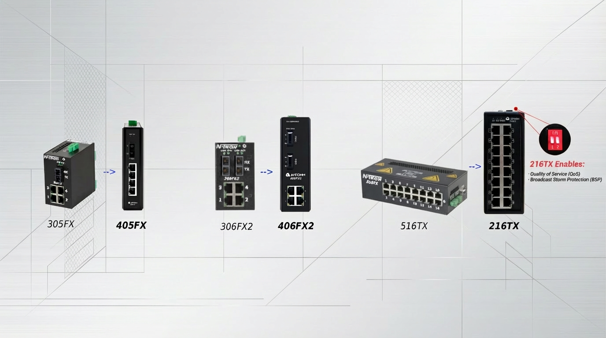

# Overview

Replacing discontinued products is a critical step to ensure continuous
and reliable production. A seamless, fast, and professionally managed
migration path is a shared goal for both Avcomm and our customers.

This document provides a detailed comparison between Avcomm models
(406FX2 and 216TX) and the discontinued N-Tron models (306FX2 and
516TX). It highlights Avcomm’s solutions as ideal replacements, offering
compact design, enhanced performance, and outstanding value.

# Quick Comparison Table

<figure>

</figure>

<table>
<colgroup>
<col style="width: 33%" />
<col style="width: 33%" />
<col style="width: 33%" />
</colgroup>
<thead>
<tr>
<th style="text-align: left;">Feature</th>
<th style="text-align: left;">N-TRON 305FX/306FX2 / 516TX</th>
<th style="text-align: left;">Avcomm 405FX/406FX2 / 216TX</th>
</tr>
</thead>
<tbody>
<tr>
<td style="text-align: left;">
Product Status
</td>
<td style="text-align: left;">
Discontinued
</td>
<td style="text-align: left;">
Active production (Fully
compatible)
</td>
</tr>
<tr>
<td style="text-align: left;">
Port Configuration
</td>
<td style="text-align: left;"><ul>
<li>
305FX: 1x FX + 4x TX
</li>
<li>
306FX2: 2x FX + 4x TX
</li>
<li>
516TX: 16x TX
</li>
</ul></td>
<td style="text-align: left;"><ul>
<li>
405FX: 1x FX + 4x TX
</li>
<li>
406FX2: 2x FX + 4x TX
</li>
<li>
216TX: 16x TX
</li>
</ul></td>
</tr>
<tr>
<td style="text-align: left;">
Installation Space
</td>
<td style="text-align: left;">
Standard industrial size
</td>
<td style="text-align: left;">
More compact (drop-in
replacement)
</td>
</tr>
<tr>
<td style="text-align: left;">
Mounting Compatibility
</td>
<td style="text-align: left;">
Fixed layout
</td>
<td style="text-align: left;">
Fully compatible with existing
mounts
</td>
</tr>
<tr>
<td style="text-align: left;">
Replacement Readiness
</td>
<td style="text-align: left;">
No longer available
</td>
<td style="text-align: left;">
Plug-and-play replacement
</td>
</tr>
</tbody>
</table>

# Key Advantages

| Category                 | N-TRON                   | Avcomm                                      |
| ------------------------ | ------------------------ | ------------------------------------------- |
| Chip Platform            | Older generation         | Upgraded platform with enhanced performance |
| Communication Capability | Meets basic requirements | Higher throughput, lower latency            |
| Power Consumption        | Higher                   | Improved energy efficiency                  |
| Lead Time                | Uncertain / long         | Fast and stable delivery                    |
| Technical Support        | Discontinued             | Strong local technical support              |
| Price-to-Performance     | Expensive                | Exceptional value                           |

# Summary

Avcomm’s 406FX2 and 216TX are not only hardware-compatible replacements
for the legacy N-Tron 306FX2 and 516TX, but also bring substantial
improvements in performance, power efficiency, and long-term supply
availability. With shorter lead times and lower total cost of ownership,
they represent the ideal upgrade path for both industrial continuity and
cost control.

**Ready to replace. Built to outperform.**

# Get a Quote & Product Details

For detailed specifications, pricing, and availability, please visit our
product pages or contact our sales team directly.

- **Avcomm 405FX Series** (Replacement for N-TRON 305FX)[View Product Page &amp; Request
  Quote](https://inc.avcomm.us/shop/405fx-sc-64#attr=)
- **Avcomm 406FX2 Series** (Replacement for N-TRON 306FX2)[View Product Page &amp; Request
  Quote](https://inc.avcomm.us/shop/406fx2-sc-1904#attr=)
- **Avcomm 216TX Series** (Replacement for N-TRON 516TX)
  [View Product Page &amp; Request
  Quote](https://inc.avcomm.us/shop/216tx-2266#attr=)

> [!NOTE]
> Need a custom volume quote or technical consultation?
> Email us at: **info@avcomm.us**
> Call us at: **(713)933-4534**

# Disclaimer

All N-Tron product names, logos, and images used in this document are
the property of their respective owners and are used for identification
and comparison purposes only. This document is an independent technical
and commercial comparison and is not affiliated with, endorsed by, or
sponsored by N-Tron or its parent companies.
